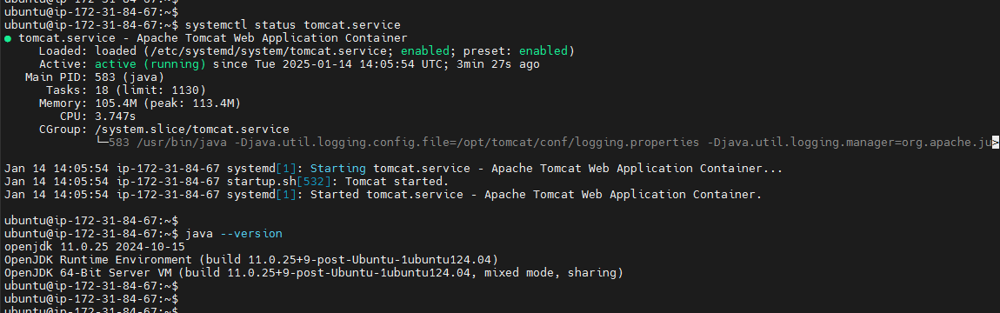

# IBA devops training

## HW18. Ansible. Webserver role deployment with AWS EC2 isntance reboot and instance status check.

#### Playbook
[ansible_aws_deploy_plbk.yml](https://github.com/voyager1122/iba_hw18/blob/main/ansible_aws_deploy_plbk.yml)



#### Play output

```bash
root@ip-172-31-81-185:/etc/ansible# ansible-playbook ansible_aws_deploy_plbk.yml

PLAY [Reboot AWS EC2 instance and deploy websrv role] *****************************************************************************************

TASK [Reboot the instance] ********************************************************************************************************************
changed: [localhost]

TASK [Wait until instance is running] *********************************************************************************************************
ok: [localhost]

TASK [Wait for SSH to become available] *******************************************************************************************************
ok: [localhost]

TASK [Get public IP address of the instance] **************************************************************************************************
ok: [localhost]

TASK [Add the instance to the host group] *****************************************************************************************************
changed: [localhost]

PLAY [Deploy websrv role] *********************************************************************************************************************

TASK [websrv : Install Java (required by Tomcat)] *********************************************************************************************
[WARNING]: Platform linux on host 54.144.62.243 is using the discovered Python interpreter at /usr/bin/python3.12, but future installation of
another Python interpreter could change the meaning of that path. See https://docs.ansible.com/ansible-
core/2.17/reference_appendices/interpreter_discovery.html for more information.
ok: [54.144.62.243]

TASK [websrv : Download Tomcat] ***************************************************************************************************************
changed: [54.144.62.243]

TASK [websrv : Extract Tomcat archive] ********************************************************************************************************
skipping: [54.144.62.243]

TASK [websrv : Create symlink to tomcat directory] ********************************************************************************************
ok: [54.144.62.243]

TASK [websrv : Ensure /etc/profile.d exists] **************************************************************************************************
ok: [54.144.62.243]

TASK [websrv : Set environment variables for Tomcat] ******************************************************************************************
ok: [54.144.62.243]

TASK [websrv : Create systemd service file for Tomcat] ****************************************************************************************
ok: [54.144.62.243]

TASK [websrv : Reload systemd] ****************************************************************************************************************
ok: [54.144.62.243]

TASK [websrv : Start Tomcat] ******************************************************************************************************************
ok: [54.144.62.243]

PLAY RECAP ************************************************************************************************************************************
54.144.62.243              : ok=8    changed=1    unreachable=0    failed=0    skipped=1    rescued=0    ignored=0
localhost                  : ok=5    changed=2    unreachable=0    failed=0    skipped=0    rescued=0    ignored=0

```
